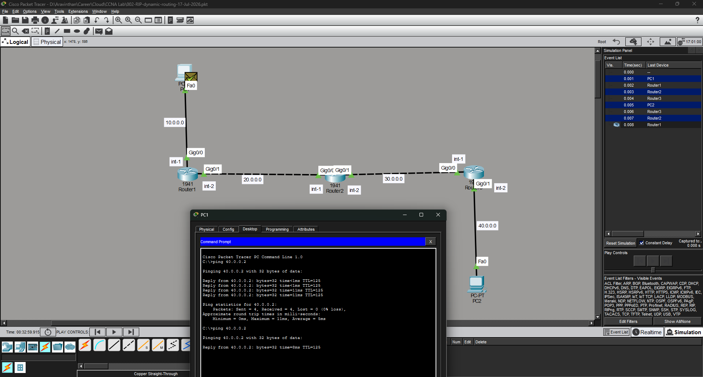

# CCNA Lab: RIP Dynamic Routing

A Cisco Packet Tracer lab where 3 routers were connected in a line topology
and configured to learn routes automatically using **RIP v2**.



## Topology

```
PC1 --- Router1 --- Router2 --- Router3 --- PC2
 10.0.0.0   20.0.0.0    30.0.0.0    40.0.0.0
```

| Device | Interface | IP Address | Network |
|---|---|---|---|
| PC1 | Fa0 | 10.0.0.2 | 10.0.0.0/8 |
| Router1 | Gig0/0 | 10.0.0.1 | 10.0.0.0/8 |
| Router1 | Gig0/1 | 20.0.0.1 | 20.0.0.0/8 |
| Router2 | Gig0/0 | 20.0.0.2 | 20.0.0.0/8 |
| Router2 | Gig0/1 | 30.0.0.1 | 30.0.0.0/8 |
| Router3 | Gig0/0 | 30.0.0.2 | 30.0.0.0/8 |
| Router3 | Gig0/1 | 40.0.0.1 | 40.0.0.0/8 |
| PC2 | Fa0 | 40.0.0.2 | 40.0.0.0/8 |

## What we did

- Configured IP addresses on 3 routers and 2 PCs
- Enabled **RIP Version 2** on all routers
- Advertised each router's connected networks using the `network` command
- Disabled auto-summarization with `no auto-summary`
- Verified that every router automatically learned the remote networks

## What we used

- `router rip`
- `version 2`
- `no auto-summary`
- `network <connected-network>`
- `show ip interface brief`
- `show ip route`

See [`configs/`](configs) for the full configuration of each router.

## Outcome

✅ All 3 routers exchanged routing updates automatically via RIP
✅ Remote networks appeared in each router's routing table (marked `R`)
✅ PC1 successfully pinged PC2 through dynamic routing — no static routes used

## Key takeaway

With dynamic routing, routers only need to know their **own connected
networks** (via the `network` command) — RIP handles sharing that
information with neighbors and building the routing table automatically.
